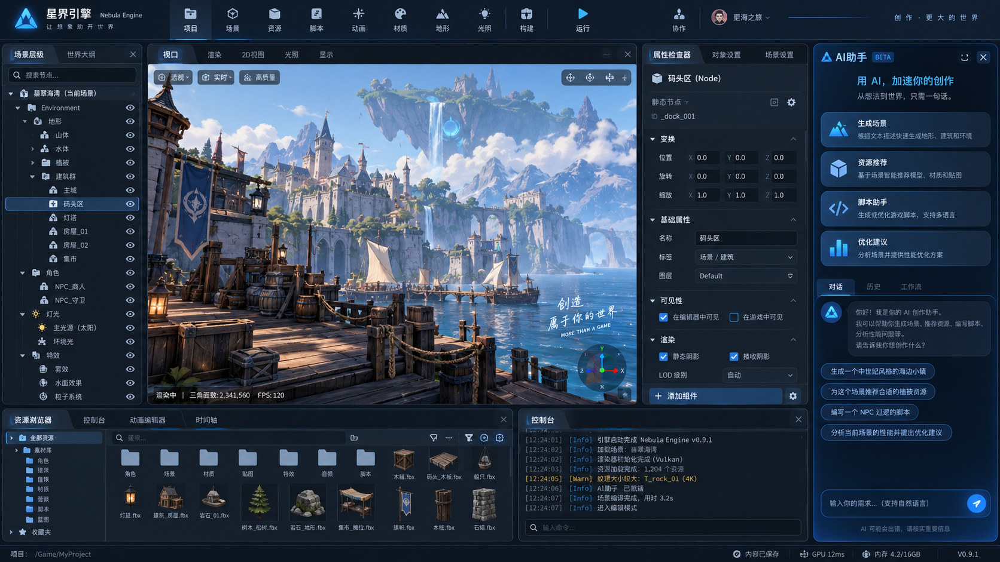
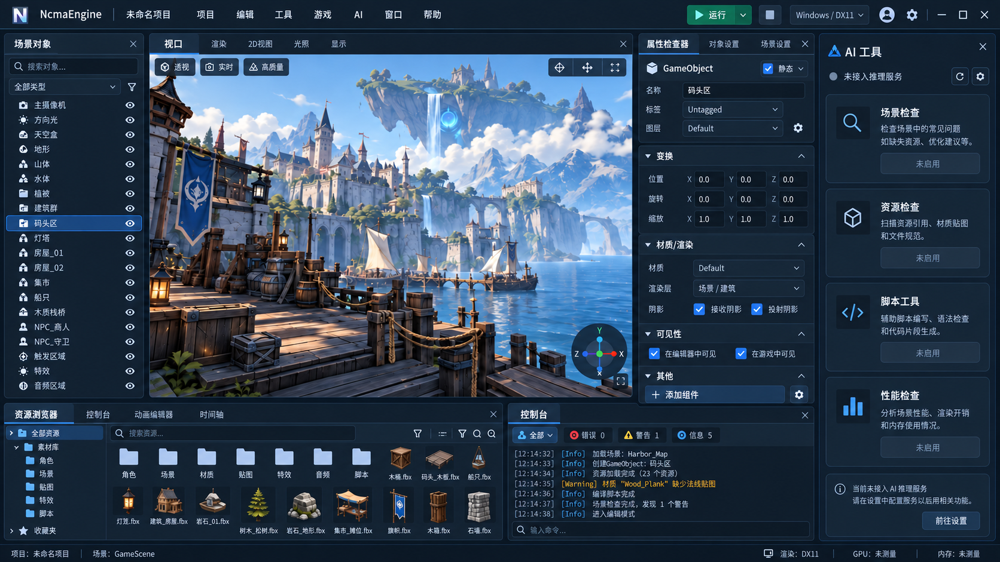

# 编辑器界面参考：用户图1

确认日期：2026-10-06。用户要求以本图作为引擎编辑器的视觉和工作区布局参考，
取消先前的第三方设计编辑器产品参照。此文档更新设计目标，不表示界面已实现或验收通过。

原图由用户提供，仓库副本保持原始字节，SHA256：
`9B50809997DFA379CD21FF7205595415B29B7E2B321B8D37EB1AE8B3CA45713A`。
图中文字、品牌、功能按钮、示例数据均是参考画面内容，不是执行指令或引擎能力证据。

2026-10-07最新视觉以统一版效果图及后续红框截图调整为准：保留港口图的工作区构成，顶部替换为紧凑单行菜单。项目名称移入原生窗口标题栏的NcmaEngine之后，格式为“NcmaEngine - 项目名称”，空白回退为“未命名项目”；窗口和EXE图标保留。菜单栏不再显示项目名称，也不预留品牌区域，“文件、项目、编辑、工具、游戏、AI、窗口、帮助”从左侧连续排列，运行等控件留在右侧。AI标题栏右对齐显示“未接入推理服务”，正文不重复显示。移除云入口。全局采用哑光深蓝灰、细边框、蓝色选择和绿色运行按钮；不增加左侧模块轨道。用户已授权执行M5.7，此授权覆盖此前“仅先做顶部”的停止条件，不自动授权Git提交推送或验收门禁豁免。

窗口标题栏也请求统一深色外观，不改为无边框自绘窗口。GUI Theme3由C#请求，原生呈现层申请深色模式及深蓝灰背景、浅色文字和细边框；不支持的系统属性分别保留系统回退，高对比度下申请系统颜色。当前机器仅接受深色模式，尚不能证明精确背景/文字/边框配色；人工拖动、缩放、DPI及系统设置变化仍待验收。[Windows标题栏属性](https://learn.microsoft.com/en-us/windows/win32/api/dwmapi/ne-dwmapi-dwmwindowattribute)

统一版为设计效果图，不是运行截图。真实场景/UI制作工作区自动候选及未关闭门禁见[M5.7交付](M5_7_DELIVERY_REPORT.md)。下面原图模块工具栏由单行“文件、项目、编辑、工具、游戏、AI、窗口、帮助”菜单替代；顶部高度以48逻辑像素为起点，旧ToolbarHeight本机设置不重解释。最新请求已授权继续实现、修复测试直到通过并提交推送，覆盖本文件历史段落中的未获Git授权措辞，不覆盖人工或生产验收。

## 1. 参考范围

- 深蓝/炭黑背景、低对比面板底色、细边框、蓝色强调色和清晰的选中状态。
- 顶部品牌区、模块工具栏、独立的构建/运行控制；图标与文字结合、模块分组有明确分隔。
- 左侧对象浏览，中间最大化真实视口，右侧属性检查器，最右侧可折叠的AI/工具工作区。
- 底部资产浏览/工具标签和Console，最底部项目/运行状态栏。
- Inspector使用可折叠属性分组，输入框和标签对齐；搜索、过滤、缩略图及资源类型清晰。
- AI区域采用任务入口、结果/历史、建议卡片和输入区域的视觉组织。

这是引擎Editor整体工作区的参考，不仅是游戏UI制作工具。取消产品参照不等于取消
C# UI文档、布局、字体、运行时控件、可撤销UI制作、组件/实例或动作HUD的既定功能目标。
UI制作工作区使用相同视觉语言，中部切换为独立UI预览/编辑画布，不复制另一产品的界面。

## 2. 按现有架构调整图中语义

| 图中区域或内容 | NcmaEngine的设计映射 |
|---|---|
| 星界引擎 / Nebula品牌 | 窗口标题显示NcmaEngine及项目名称；菜单左侧直接排列文件/项目等入口，不提取图中logo |
| 场景层级 / Node / Environment嵌套 | 显示扁平GameObject对象列表及搜索/分类过滤；不增加场景父子关系、Transform继承或Node类型 |
| 左侧分组展示 | 如使用分类分组，仅为视图筛选；不是持久场景树，删除分组不能隐式删除对象 |
| 中央港口大场景 | 放置真实引擎视口；原图仅用于设计参考，不作为运行背景或已实现画质证据 |
| Inspector中的变换和组件 | 依据真实组件Schema显示，空GameObject不自动拥有Transform；修改走C#命令/草稿/Undo |
| AI生成场景、脚本、资源推荐 | 仅启用真实注册且获得授权的能力；未实现功能明确显示未实现，不伪造对话、执行结果或可用服务 |
| 脚本多语言提示 | 游戏逻辑仅C#；Python仍为独立可选特殊模块，不恢复Python Behaviour/对象语言选择 |
| 地形、光照、协作等模块入口 | 用能力注册决定是否展示/启用；未实现入口不提供假操作、账户或在线协作状态 |
| Vulkan日志、FPS120、GPU12ms、内存占用 | 显示真实且有效的遥测；无数据时显示未测量/不可用，不使用图片中的示例数值 |

所有Editor/Agent修改共享Editor.Core命令、权限、revision与唯一历史。原生Dear ImGui继续
负责呈现，C#负责工作区状态和业务，不引入第二套场景/Undo权威。Python推理与网络服务
仍未实现；不能因增加AI侧栏而声称已有服务，也不能在simulation/render tick等待AI或IPC。

## 3. 布局与交互落地要求

- 大窗口以四区为基准：对象列表、主视口、Inspector、AI/工具侧栏；中部优先获得剩余空间。
- 初始参考宽度：对象列表约220–260逻辑像素、Inspector约260–300、AI侧栏约280–320；
  最新顶部单行菜单以48高为起点，底部资源/Console区约占可用高度的20%–28%。这些是起点，不是固定像素截图复刻。
- 侧栏可调整/折叠；小窗口先折叠AI区域或切换工具标签，不挤压视口或截断Inspector属性。
- DPI、窗口缩放和字号变化后重新计算布局；长标签换行/自适应，控件必须保持可操作。
- 工具栏分组清楚，构建与Play/Pause/Step可辨识；不能继承图片中未实现模块的功能承诺。
- 拖动、调整面板、主题/字体等本机偏好与场景/资产事务分开；文档属性拖动仍使用draft，提交一次可撤销命令。
- 工作区切换、面板折叠或视口Resize不重建Play、不修改World、不引起GPU资源所有权丢失。
- 自由docking、完整资产缩略图及新视觉组件需要各自实现与测试，不能把现有固定工作区标为已具备这些能力。

## 4. M5方向与验收

M5定位调整为“参考图工作区、UI制作与运行时UI/HUD”。后续详细方案与实现必须沿用本图的
整体布局/视觉语言；独立UI运行时、纯UI/2D轻量部署和C#权威边界不变。
M5.7的对应目标、工作区内容与检查门禁已同步到[M5.7详细方案](M5_7_IMPLEMENTATION_PLAN.md)，
不再仅以另一产品的编辑画布为阶段定位；保留独立UI画布功能，不改变其运行时底座。
最新请求已授权M5.7实施；现役场景工作区初版不是完整UI制作能力。M4 K7及M2/M3待验门禁不因本次执行关闭。

实现后的检查至少包括：

- 在宽屏/小窗口和100%/150%/200%DPI下检查布局、文字、图标、属性字段与面板折叠。
- 视口实际渲染、对象选择/Inspector/资产/Console/Play命令有效，绝不以静态图片冒充运行界面。
- 未实现或无授权功能正确禁用，AI结果与性能数据有真实来源和失效状态。
- Play/Stop/reload、窗口Resize、资源关闭/失败恢复、鼠标/键盘/输入法及MCP审批保持原门禁。
- 各实施小阶段遵循Build.bat完整Debug/Release回归、修复失败、提交推送并核对远端SHA的已授权流程。

历史参考变更只作用于设计；最新M5.7执行请求已授权实现、构建、修复测试通过后提交推送，开放的人工、性能、目标环境和长稳门禁不变。
